

# **Análise do _Dataset_ da Plataforma _Airbnb_**

**ISCTE – Instituto Universitário de Lisboa**  
**Curso:** Mestrado em Engenharia Informática  
**Unidade Curricular:** Aprendizagem Automática  
**Docente:** Professor Doutor Luís Nunes  

David Alexandre Viera Marques  
Nº83213 davms@iscte-iul.pt

Sandro Camilo Alpoim Ferreira  
Nº83449 scafa1@iscte-iul.pt

**RESUMO**

O presente artigo está inserido no âmbito da unidade curricular de Aprendizagem Automática. O seu objetivo é, através da revisão de literatura e interpretação do _dataset_ da plataforma _Airbnb,_ implementar algoritmos de aprendizagem automática que permitam a predição de características do mesmo. Tendo em consideração a constituição do conjunto de dados os mecanismos utilizados serão regressões lineares e polinomiais com recurso a _python_.

**Palavras-chave:** _Airbnb_, aprendizagem automática, _machine learning_ e análise de dados.

## 1. INTRODUÇÃO

O _dataset_ analisado contém dados obtidos através do _Airbnb_[1] da cidade de Lisboa, que resulta da agregação dos múltiplos _datasets_ disponibilizados, totalizando 147470 registos com 20 atributos. Para a agregação dos mesmos foram adicionadas as colunas inexistentes aos registos mais antigos e foram comparados os seus identificadores para garantir que não existissem registos duplicados.

### 1.1. Os objetivos da análise dos dados são:

* Treinar um modelo capaz de prever qual o valor de uma estadia por noite de acordo com as suas características;
* Criar um modelo capaz de recomendar uma casa de acordo com as características pretendidas;
* Verificar quais as variáveis que têm mais peso no valor de uma estadia;
* Tentar relacionar a satisfação dos hóspedes com as características da habitação.

### 1.2. Caracterização dos dados:

| **#** | **Atributo** | **Tipo** | **Descrição** |
| --- | --- | --- | --- |
| 1 | _room\_id_ | _int_ | Identificador único da publicação do _Airbnb_. O _URL_ da publicação é constituído por: _http://airbnb.com/rooms/{room\_id}_; |
| 2 | _survey\_id_ | _int_ | Identificador único do questionário do _Airbnb_. |
| 3 | _host\_id_ | _int_ | Identificador único do anfitrião do _Airbnb_. O _URL_ do anfitrião é constituído por: _http://airbnb.com/users/show/{host\_id}_; |
| 4 | _room\_type_ | _string_ | Define o tipo do quarto, sendo as opções: &quot;_Entire home/apt_&quot;, &quot;_Private room_&quot; e &quot;_Shared room_&quot;. |
| 5 | _country_ | _string_ | País onde o alojamento está localizado. |
| 6 | _city_ | _string_ | Cidade onde o alojamento está localizado. |
| 7 | _borough_ | nd. | Freguesia da cidade de Lisboa onde o estudo foi realizado. |
| 8 | _neighborhood_ | _string_ | Bairro onde o estudo foi realizado. |
| 9 | _reviews_ | _int_ | Número de _reviews_ feitas ao alojamento. Segundo o _Airbnb_ em cerca de 70% das visitas é feita uma _review_, podendo isto ser usado para calcular o número total de visitas. |
| 10 | _overall satisfaction_ | _float_ | Classificação média da satisfação dos clientes do alojamento. |
| 11 | _accommodates_ | _int_ | Número de visitantes que o alojamento pode acomodar. |
| 12 | _bedrooms_ | _int_ | Número de quartos do alojamento. |
| 13 | _bathrooms_ | _int_ | Número de casas de banho do alojamento. |
| 14 | _price_ | _float_ | Preço em dólares americanos para uma noite. |
| 15 | _minstay_ | _int_ | Número mínimo de dias para a estadia. |
| 16 | _name_ | _string_ | Nome do alojamento. |
| 17 | _last\_modified_ | _date time_ | Data e hora em que os dados foram obtidos do site do _Airbnb_. |
| 18 | _latitute_ | _int_ | Latitude do alojamento. |
| 19 | _longitude_ | _int_ | Longitude do alojamento. |
| 20 | _location_ | _string_ | Localização do _google__maps_. |

## 2. PROCESSAMENTO DO _DATASET_

Uma das mais importantes etapas é a limpeza dos dados para garantir a integridade e conformidade dos mesmos, para que posteriormente possam ser utilizados nos algoritmos de inteligência artificial. Na etapa de processamento dos dados foram removidas as colunas e registos com as seguintes características e ordem:

* Colunas com identificadores únicos;
* Colunas cuja totalidade do valor dos atributos é igual ou nulo;
* Coluna _location_ e _name_ por os atributos serem únicos em cada um dos registos;
* Substituição dos valores do atributo _overall\_satisfaction_ com os valores 0,0 por _NaN_, para posteriormente serem removidos;
* Substituição dos valores _NaN_ do atributo _minstay_ por 1;
* Remoção de todos os registos com valores nulos;
* Remoção de _outliers;_
* Substituição dos valores categóricos através de metodologias _one hot encoding_ e _label encoding_.

A aplicação das regras reduziu o número total de colunas para 8 e de registos para 96904.

### 2.1. Remoção das colunas desnecessárias:

  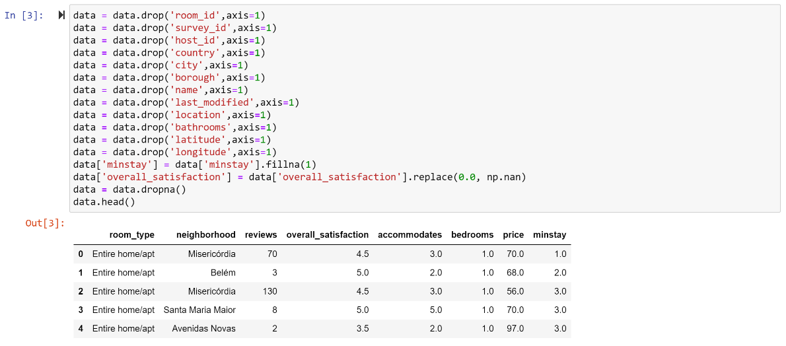

  **Figura 1 - Regras de Pré-processamento**

### 2.2. Remoção de _Outliers_:

  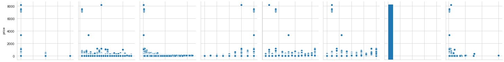
  
  **Figura 2 - Dados com _Outliers_**

Através da análise da figura anterior observámos a existência de _outliers_, tendo estes sido removidos por forma a normalizar o conjunto de dados. A remoção dos _outliers_ foi feita da seguinte forma:

* Para cada coluna, é primeiramente computado o resultado de cada valor, relativo à média dessa mesma coluna e ao seu desvio padrão;
* Posteriormente, é considerado o resultado absoluto, pois a direção não é relevante, exceto se for abaixo do limite;
* Finalmente, o resultado desta condição é usado para indexar o conjunto de dados.

  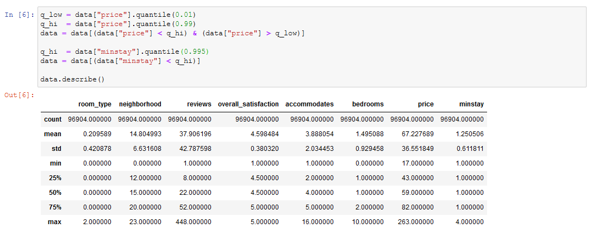
  
  **Figura 3 - Remoção de _Outliers_**

  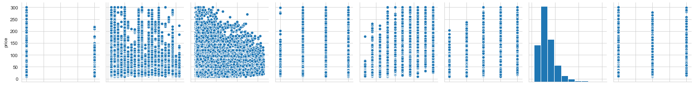
  
  **Figura 4 - Dados sem _Outliers_**

### 2.3. Substituição dos dados categóricos:

Considerando que este modelo não aceita dados categóricos, foi realizada a codificação das propriedades _neighborhood_ e _room\_type_, em valores numéricos. Sendo que as mesmas não possuem uma ordem natural, trata-se de variáveis nominais, representativas de uma categoria.

As abordagens mais comuns para realizar esta codificação são com:

- _Ordinal Encoding_

Faz a codificação para valores numéricos, mas com indicação explícita da ordem das categorias (exemplo: _cool_, _mild_, _hot_)

- _Label Encoding_

Faz a codificação para valores numéricos, mas sem ordem (exemplo: _hot_, _cool_, _mild_)

Estas abordagens, por si só não são as mais adequadas neste caso, sendo que a importância das propriedades em questão não é medida pelo seu valor numérico, pelo que, simplesmente fazer essa associação (categoria-número incremental), poderia induzir em erro o modelo, resultando numa fraca predição ou resultados inesperados.

- One Hot Encoding:

Esta abordagem, ao contrário das anteriores, cria uma nova variável binária para cada categoria, em vez de simplesmente codificar cada categoria num número incremental. Este processo aumenta significativamente o desempenho do modelo, como se pode observar pelas matrizes de correlação abaixo. [2]

#### 2.3.1. Label Encoding:

Nesta abordagem inicial foi feita a substituição dos valores do _neighborhood_ e do _room\_type_ por valores inteiros, de forma a possibilitar a sua inserção nos algoritmos de análise. Tendo resultado a seguinte matriz de correlação entre as propriedades do _dataset_.

  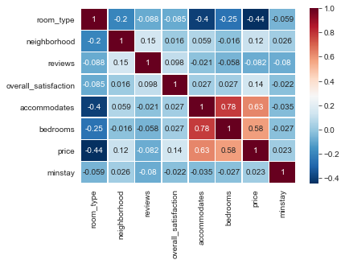
  
  **Figura 5 - Matriz de Correlação usando _Label Encoding_**

#### 2.3.2. _One Hot Encoding_:

Tal como na abordagem anterior, foi feita uma substituição das mesmas variáveis, mas utilizando o mecanismo _one hot encoding,_ resultando na seguinte matriz de correlação.

  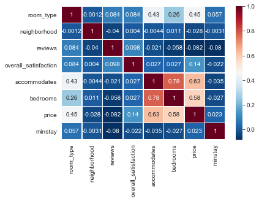
  
  **Figura 6 - Matriz de Correlação usando _One Hot Encoding_**

Através da análise das matrizes de correlação, é visível a diferença no atributo _room\_type_, onde passa a existir uma maior correlação com os atributos preço (_price_), quartos (_bedrooms_) e número de hóspedes (_accommodates_).

##### 2.3.2.1. Análise de Correlação:

A análise de correlação é uma técnica que permite identificar relações interessantes nos dados, que por sua vez nos permitem compreender a relevância dos diferentes atributos, no que diz respeito à variável de _output_ pretendida.

Através desta análise podemos constatar que:

- A correlação de uma propriedade com ela mesma é sempre 1;
- O preço é impactado pela variação das variáveis _room\_type, accommodates e overhall\_satisfaction_;
- O _room\_type_ está associado ao _accommodates, bedrooms e price_;
- Constatámos também que o número de hóspedes (_accommodates_) que o alojamento pode acomodar está diretamente associado ao número de quartos (_bedrooms_).

### 2.4. Descrição dos Dados Limpos:

| **Total** | **Média** | **Desvio Padrão** | **Mínimo** | **25%** | **50%** | **75%** | **Máximo** |
| --- | --- | --- | --- | --- | --- | --- | --- | --- |
| _ **reviews** _ | 96904 | 37,906 | 42,788 | 1 | 22 | 22 | 52 | 448 |
| _ **overall\_statisfaction** _ | 96904 | 4,598 | 0,380 | 1 | 4,5 | 4,5 | 5 | 5 |
| _ **accommodates** _ | 96904 | 3,888 | 2,034 | 1 | 2 | 4 | 5 | 16 |
| _ **bedrooms** _ | 96904 | 1,495 | 0,929 | 0 | 1 | 1 | 2 | 10 |
| _ **price** _ | 96904 | 67,228 | 36,551 | 17 | 43 | 59 | 82 | 263 |
| _ **minstay** _ | 96904 | 1,251 | 0,612 | 1 | 1 | 1 | 1 | 4 |

## 3. VISUALIZAÇÃO E ANÁLISE DOS DADOS

A visualização e análise dos dados permite obter um melhor conhecimento dos mesmos através da visualização da sua tendência, facilitando o processo de identificação de padrões. As imagens abaixo permitem descrever os múltiplos atributos que constituem o _dataset_.

  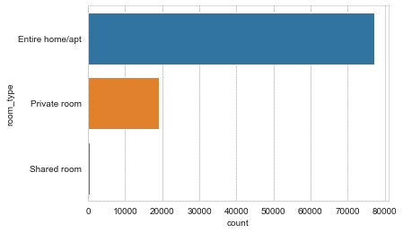
  
  **Figura 7 - Valores da Propriedade _room type_**

A propriedade _room\_type_ pode assumir três valores diferentes, com a seguinte distribuição: _Entire home/apt_: 77150; _Private room_: 19198; _Shared room_: 556.

Podemos observar uma fraca distribuição das _reviews_ para os vários tipos de casas, onde os _shared rooms_ são quase inexistentes, tendo sido excluídos do algoritmo de remoção dos _outliers_ para evitar o seu desaparecimento.

  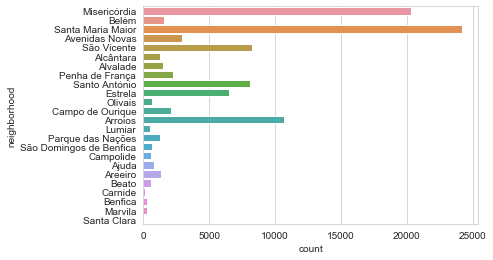
  
  **Figura 8 - Valores da Propriedade _neighborhood_**

A propriedade _neighborhood_ pode assumir vinte e quatro valores diferentes, com a seguinte distribuição: Santa Maria Maior: 24189; Misericórdia: 20319; Arroios: 10653; São Vicente: 8258; Santo António: 8118; Estrela: 6479; Avenidas Novas: 2928; Penha de França: 2264; Campo de Ourique: 2119; Belém: 1572; Alvalade: 1465; Areeiro: 1362; Alcântara: 1290; Parque das Nações: 1271; Ajuda: 827; Olivais: 672; Campolide: 619; São Domingos de Benfica: 622; Beato: 619; Lumiar: 541; Benfica: 286; Marvila: 246; Carnide: 120; Santa Clara: 87.

Pode observar uma fraca distribuição nas localizações, podendo isto afetar a capacidade de predição do algoritmo.

  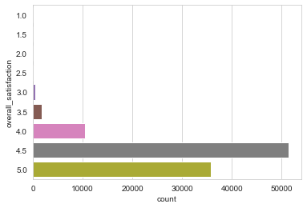
  
  **Figura 9 - Valores da Propriedade _overall satisfaction_**

A satisfação média (_overall\_satisfaction_) pode assumir nove diferentes valores, com a seguinte distribuição: 4,5: 49824; 5,0: 34747; 4,0: 9949; 3,5: 1729; 3,0: 472; 2,5: 120; 2,0: 51; 1,0: 13; 1,5: 10.

Podemos observar uma fraca distribuição nas classificações médias, onde faltam dados sobre as classificações mais baixas. Este pode ser um problema na capacidade de predição do algoritmo.

  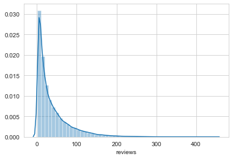
  
  **Figura 10 - Distribuição do Atributo _price_**

Podemos observar que a maioria dos preços estão compreendidos entre os 0 e os 100 $.

  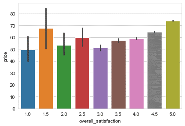
  
  **Figura 11 - Relação entre os Atributos _price_ e _overall satisfaction_**

Através da análise da relação entre o preço (_price_) e a satisfação média (_overall\_satisfaction_) podemos observar que a classificação mínima atinge o menor (4,5) patamar de preços, enquanto que a classificação mais elevada (5,0) está associada a preços mais elevados.

## 4. ALGORITMOS UTILIZADOS

Sendo que o _dataset_ utilizado tem dados rotulados, e temos disponíveis o conjunto de variáveis dependentes (_output_) e independentes (_input_) relacionados entre si, a abordagem escolhida foi a utilização de algoritmos supervisionados para treinar os nossos modelos de forma a aprender sobre essa relação, com o objetivo de fazer as previsões desejadas.

  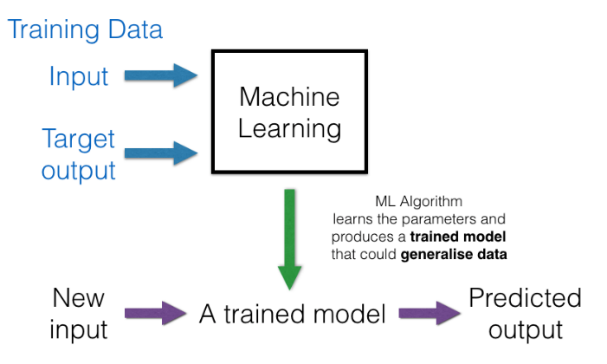
  
  **Figura 12 - Visão Geral de um Algoritmo de _Machine Learning_**

### 4.1. Regressão

Modelos de regressão são utilizados para prever valores contínuos, como o preço de uma estadia num alojamento, com base em características relevantes.

Observando que a maioria das variáveis no _dataset_ são contínuas e não categóricas, e tendo em conta os objetivos propostos, chegámos à conclusão de que a utilização de algoritmos de regressão, seria a abordagem mais adequada na resolução dos problemas que nos propusemos a resolver.

#### 4.1.2. Regressão Linear Múltipla:

A regressão linear simples estabelece a relação entre duas variáveis, tentando desenhar uma linha que se aproxima o mais possível dos dados, localizando a inclinação e a intercetação que definem essa linha, minimizando erros de regressão. É uma das principais ferramentas na estatística, e visa prever uma variável de _output_ dependente (Y), baseando-se nas variáveis de _input_ independentes (X), com uma relação existente entre elas(correlação), representada por um modelo matemático. [3]

Raramente uma variável dependente é predita por apenas 1 variável independente. Nos casos da existência de múltiplas variáveis independentes, é utilizada regressão múltipla, e esta pode ser linear e não linear.

  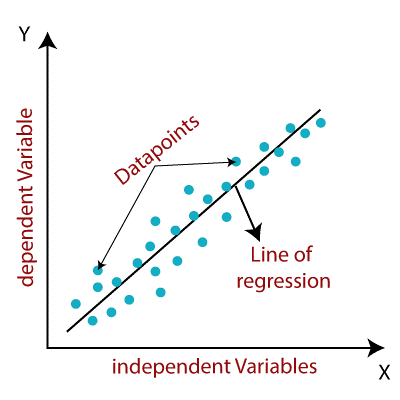
  
  **Figura 13 - Regressão Linear**

#### 4.1.3. Regressão Polinomial:

A regressão polinomial é uma forma de análise de regressão, em que a relação entre a variável independente(x) e dependente(y) é modelada como um polinómio de grau n em x. [4]

#### 4.1.4. Análise Dos Resultados Da Regressão:

**Erro Médio Absoluto (_MAE_):** O _MAE_ mede a magnitude média dos erros num conjunto de predições, sem considerar a sua direção. Representa a média ao longo das amostras de teste, das diferenças absolutas entre predição e observação real, onde todas as diferenças individuais têm peso igual. Não é sensível a _outliers_ quando comparado ao _MSE_, sendo que não castiga grandes erros. É habitualmente utilizado quando o desempenho é medido com base em dados contínuos, e devolve um valor linear, que calcula a média das diferenças individuais, ponderadas igualmente. Quanto mais baixo o valor, melhor é o desempenho do modelo.

  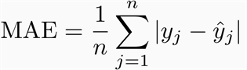
  
  **Figura 14 - Cálculo do Erro Médio Absoluto**

**Erro Médio Quadrático (_MSE_):** Calculado com a média entre o quadrado da diferença entre os dados originais e preditos. Na maioria dos problemas de regressão, esta métrica é usada para determinar o desempenho do modelo. É uma das métricas mais comummente utilizadas, mas pouco útil sendo que uma única má predição pode arruinar a capacidade de predição do modelo, isto é, quando o conjunto de dados contém demasiado ruído. É mais útil quando o conjunto de dados contém _outliers_, ou valores inesperados.

**Raiz Quadrada do Erro-Médio (_RMSE_)**: É uma medida que calcula a raiz quadrática média dos erros entre valores observados (reais), e predições (hipóteses). No _RMSE_, os erros são elevados ao quadrado antes de se calcular a média. Isto significa que o _RMSE_ atribui um maior peso a erros maiores, indicando ser mais útil aquando da presença de grandes erros, que afetem drasticamente o desempenho do modelo. Evita tomar o valor absoluto do erro, e esta característica é útil em muitos cálculos matemáticos. Nesta métrica, quanto menor o valor, melhor é o desempenho do modelo.

  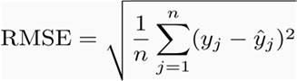
  
  **Figura 15 - Cálculo da Raiz Quadrada do Erro Médio**

**[_MAE_] ≤ [_RMSE_]**. O resultado do _RMSE_ será sempre maior ou igual ao do _MAE_. Se todos os erros tiverem a mesma magnitude, então _RMSE_=_MAE_. [5]

## 5. IMPLEMENTAÇÃO

### 5.1. Regressão Linear Múltipla

A divisão dos dados de teste foi feita com um rácio de 20% dos dados originais, na seguinte ordem:

  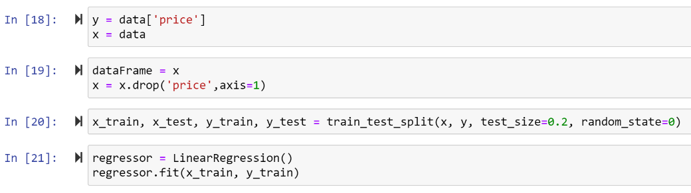
  
  **Figura 16 - Código da Regressão Linear**

Tendo sido obtidos os seguintes coeficientes:

|| **Coeficiente** |
| --- | --- |
| _room__\_type_ | 21.940168 |
| _neighborhood_ | -12.490831 |
| _reviews_ | -0.077593 |
| _overhall__\_satisfaction_ | 10.904467 |
| _accommodates_ | 5.616551 |
| _bedrooms_ | 10.514688 |
| _minstay_ | 1.325308 |

Através da análise da tabela dos coeficientes retiramos a seguinte informação:

* O aumento de 1 unidade nas seguintes propriedades impacta o preço em:
  * Satisfação média: 10.904467$
  * Número de hospedes: 5.616551$
  * Número de quartos: 10.514688$
  * Número de dias: 1.325308$

  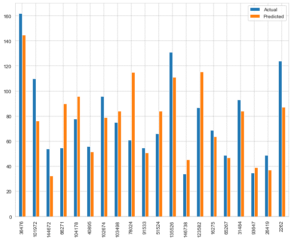
  
  **Figura 17 - Comparação entre os Dados Previstos e os Atuais da Regressão Linear**

  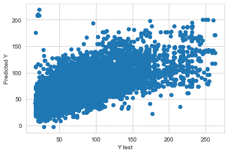
  
  **Figura 18 - Dispersão da Predição e dos Testes da Regressão Linear**

|||
|---|---|
| **Erro Médio Absoluto** | 18.559050026435113 |
| **Erro Médio Quadrático** | 707.8370238932661 |
| **Raiz Quadrada do Erro Médio** | 26.605206706456276 |

A raiz quadrada do erro médio é inferior a 25% dos valores médios do _dataset_, indicando que o algoritmo permite fazer boas predições apesar de pouco precisas. O facto de o erro médio absoluto ser inferior ao desvio padrão é também um bom indicador.

### 5.2. Regressão Polinomial/Quadrática

O conjunto de dados utilizado para a regressão quadrática é igual ao da regressão linear, com a diferença de que o mesmo é elevado ao quadrado:

  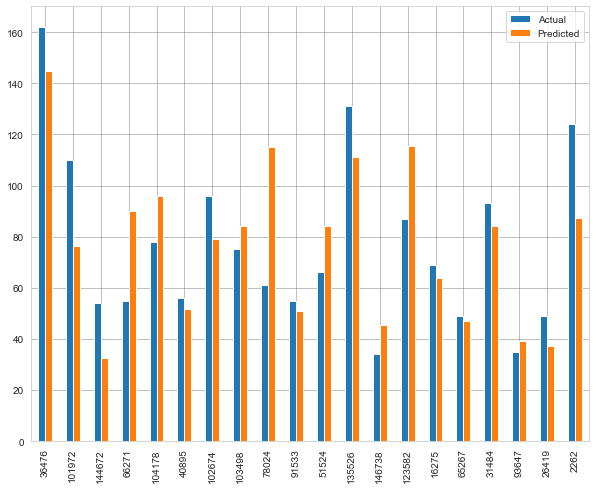
  
  **Figura 19 - Código da Regressão Quadrática**

  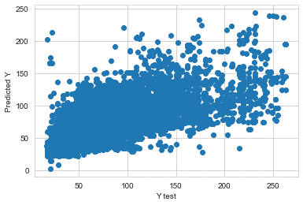
  
  **Figura 20 - Comparação entre os Dados Previstos e os Atuais da Regressão Linear**

  
  
  **Figura 21 - Dispersão da Predição e dos Testes da Regressão Quadrática**

|||
|---|---|
| **Erro Médio Absoluto** | 18.027945453279557 |
| **Erro Médio Quadrático** | 677.7216969331704 |
| **Raiz Quadrada do Erro Médio** | 26.033088501619826 |

Através da análise dos resultados obtidos vemos que a diferença para a regressão linear é bastante baixa, podendo ser retiradas as mesmas conclusões.

## 6. CONCLUSÃO

O objetivo do projeto foi parcialmente cumprido. Apesar de termos tido sucesso nas predições relativas ao preço da estadia por noite, bem como feito uma análise das variáveis mais impactantes na mesma, não nos foi possível criar um modelo capaz de recomendar alojamentos com base nas suas características, e concluímos também que não existia uma correlação entre as características da habitação e a satisfação dos hóspedes.

Devido à fraca representatividade de certas categorias e pela qualidade dos dados no _dataset_, as suas capacidades de predição poderão ter sido impactadas, como por exemplo, a variável de classificação média, ter um valor de 4.5 numa escala de 1 a 5.

Apesar disso, conseguimos criar um modelo com uma boa capacidade de predição, e considerámos que o pré-processamento realizado foi fundamental nesse sentido. A correlação entre atributos melhorou significativamente com a remoção dos _outliers_, e a escolha certa do tipo de codificação para as colunas categóricas, sendo notória a diferença na precisão atingida.

## 7. REFERÊNCIAS

[1] &quot;Airbnb Data Collection: Get the Data - Tom Slee.&quot; http://tomslee.net/airbnb-data-collection-get-the-data (accessed Jul. 11, 2020).

[2] &quot;ONE HOT ENCODING AND LABEL ENCODING,&quot; _mc.ai_. https://mc.ai/one-hot-encoding-and-label-encoding-2/ (accessed Jul. 11, 2020).

[3] A. Bronshtein, &quot;Simple and Multiple Linear Regression in Python,&quot; _ards Data Science_. https://towardsdatascience.com/simple-and-multiple-linear-regression-in-python-c928425168f9 (accessed Jul. 11, 2020).

[4] A. Hershy, &quot;Simple Linear vs Polynomial Regression,&quot; _Towards Data Science_. https://towardsdatascience.com/linear-vs-polynomial-regression-walk-through-83ca4f2363a3 (accessed Jul. 12, 2020).

[5] &quot;MAE and RMSE — Which Metric is Better? | Human in a Machine World,&quot; _Medium_. https://medium.com/human-in-a-machine-world/mae-and-rmse-which-metric-is-better-e60ac3bde13d (accessed Jul. 13, 2020).
